# Kelompok K-07 Laporan Resmi Jarkom Modul 1

## Anggota Kelompok

| Nama                   | NRP        |
| :--------------------- | :--------- |
| Evandra Raditya Fauzan | 5027251001 |
| Keisya Dira Anugerah   | 5027251055 |

## Daftar Isi

1. [Topologi Jaringan](#1-topologi-jaringan)
2. [Network Address Translation](#2-network-address-translation)
3. [Static Routing](#3-static-routing)
4. [Firewall dan iptables](#4-firewall-dan-iptables)
5. [Initial Script](#5-initial-script)
6. [Identifikasi Paket ICMP dan DNS](#6-identifikasi-paket-icmp-dan-dns)
7. [FTP Server](#7-ftp-server)
8. [Analisis Paket FTP](#8-analisis-paket-ftp)
9. [Permission Denied 550](#9-permission-denied-550)
10. [Analisis Ping Request](#10-analisis-ping-request)

## Laporan Resmi

### 1. Topologi Jaringan


Topologi Jaringan dibuat menjadi seperti gambar di atas. Sebuah router dengan nama `Lain` terhubung ke sebuah adapter NAT untuk terkoneksi dengan internet. Router tersebut menjadi gateway utama dari beberapa jaringan yang ada di bawahnya. Pada layer dibawah router terdapat 3 buah switch yang masing masing terhubung dengan 1 hingga 2 client.

#### Switch 1

- Network: 10.67.1.0/24
- Netmask: 255.255.255.0
- Gateway: 10.67.1.1/24

##### Alice

- IP: 10.67.1.2/24
- Netmask: 255.255.255.0
- Default Gateway: 10.67.1.1/24

##### Mika

- IP: 10.67.1.3/24
- Netmask: 255.255.255.0
- Default Gateway: 10.67.1.1/24

#### Switch 2

- Network: 10.67.2.0/24
- Netmask: 255.255.255.0
- Gateway: 10.67.2.1/24

##### Chisa

- IP: 10.67.2.2/24
- Netmask: 255.255.255.0
- Default Gateway: 10.67.2.1/24

#### Switch 3

- Network: 10.67.3.0/24
- Netmask: 255.255.255.0
- Gateway: 10.67.3.1/24

##### Knights

- IP: 10.67.3.2/24
- Netmask: 255.255.255.0
- Default Gateway: 10.67.3.1/24

##### Eiri

- IP: 10.67.3.3/24
- Netmask: 255.255.255.0
- Default Gateway: 10.67.3.1/24

Semua konfigurasi interface terdapat pada folder [config](./config)

### 2. Network Address Translation

Pada router Lain, interface `eth0` dapat dikoneksikan ke sebuah adapter NAT untuk mendapatkan akses internet.

### 3. Static Routing

Semua device yang terhubung ke router lain berada pada subnet/jaringan yang berbeda. Agar mereka bisa saling berkomunikasi maka router `Lain` harus dikonfigurasi dengan static routing.

Jaringan akan dipetakan ke interface tujuan dari jaringan tersebut. Harapannya client yang ada pada jaringan yang berbeda dapat mengetahui ke mana mereka harus berkomunikasi.

```
# /etc/network/interfaces
10.67.1.0/24 dev eth1 proto kernel scope link src 10.67.1.1
10.67.2.0/24 dev eth2 proto kernel scope link src 10.67.2.1
10.67.3.0/24 dev eth3 proto kernel scope link src 10.67.3.1
```

#### Bukti jaringan sudah terhubung

1. Knights ke network 10.67.1.0/24
   

2. Knights ke network 10.67.2.0/24
   

3. Knights ke network 10.67.3.0/24
   

4. Alice ke network 10.67.1.0/24
   

5. Alice ke network 10.67.2.0/24
   

6. Alice ke network 10.67.3.0/24
   

7. Mika ke network 10.67.1.0/24
   

8. Alice ke network 10.67.2.0/24
   

9. Alice ke network 10.67.3.0/24
   

\*untuk client di network yang sama tidak kami cantumkan pada lapres

### 4. Firewall dan iptables

Meskipun router sudah terhubung dengan sebuah adapter NAT. Client yang terhubung tidak bisa langsung terkoneksi ke internet. Router perlu dikonfigurasi dengan sebuah firewall untuk meneruskan akses internet yang dimiliki router ke client yang terhubung.

```bash
iptables -t nat -A POSTROUTING -o eth0 -j MASQUERADE
sysctl -w net.ipv4.ip_forward=1
```

Command di atas akan menambahkan ke chain POSTROUTING dari interface eth0, masquarade akan menggantikan ip lokal ke ip public milik interface eth0 dari router `Lain`.

Agar tiap client bisa menerjemahkan domain ke alamat ip, maka tiap client wajib menambahkan `nameserver` yang digunakan, dalam hal ini dapat menggunakan `8.8.8.8` sebagai default dns/nameserver.

```bash
echo "nameserver 8.8.8.8" > /etc/resolv.conf
```

Berikut bukti client dapat terhubung ke internet dan melakukan ping ke google.com


### 5. Initial Script

Untuk memastikan keseluruhan konfigurasi jaringan tidak menghilang ketika terjadinya restart maka kami membuat beberapa initial script untuk melakukan setup jaringan.

Initial script pertama adalah terkait iptables/firewall dan juga dns.

Kami menambahkan script berikut ke dalam file /root/init.sh

```bash
iptables -t nat -A POSTROUTING -o eth0 -j MASQUERADE
sysctl -w net.ipv4.ip_forward=1
```


Untuk kebutuhan pengecekan/verifikasi interface dan table NAT, kami membuat file baru yaitu `cek_status.sh`

```bash
#!/bin/bash
echo "=== RINGKASAN INTERFACE ==="
ip -br a
echo ""
echo "=== TABEL NAT POSTROUTING ==="
iptables -t nat -L POSTROUTING -v -n
```

Tak lupa kami memasukkan script running file `/root/cek_status.sh` ke dalam `/root/init.sh`


### 6. Identifikasi Paket ICMP dan DNS

Berdasarkan file traffic.pcapng yang digenerate oleh script traffic_protocol7.sh, terdapat 48 paket yang tertangkap oleh filter dns or  
 icmp. Berikut adalah rincian aktivitasnya:

#### 1. Traffic DNS (Domain Name System)

Filter wireshark dapat menggunakan display filter berikut:

```wireshark
dns or icmp
```

Terlihat adanya aktivitas resolving domain (pencarian alamat IP) ke dua server DNS berbeda (Google 8.8.8.8 dan Cloudflare 1.1.1.1):

- Ke 8.8.8.8:
  - Query A (IPv4) dan AAAA (IPv6) untuk its.ac.id, google.com, dan example.com.
  - Query PTR (Reverse DNS) untuk IP 103.94.189.5 (milik its.ac.id).

    
    

- Ke 1.1.1.1:
- - Query A (IPv4) dan AAAA (IPv6) untuk github.com dan cloudflare.com.
  - Terdapat balasan (response) dari masing-masing server DNS yang memberikan IP Address untuk domain-domain tersebut, baik berupa record
    A maupun SOA (Start of Authority) ketika record yang dicari tidak tersedia/membutuhkan otoritas lebih lanjut.

#### 2. Traffic ICMP (Internet Control Message Protocol)

Setelah beberapa alamat IP berhasil didapatkan via DNS, terjadi pengiriman ping (Echo Request & Reply) dari IP sumber 10.67.1.2 (Mika) ke tiga
tujuan yang berbeda:

- Ping ke IP 1.1.1.1: Terjadi 5 kali pertukaran (Request & Reply).
- Ping ke IP 8.8.8.8: Terjadi 5 kali pertukaran (Request & Reply).
- Ping ke IP 103.94.189.5 (IP dari its.ac.id yang didapat melalui DNS sebelumnya):

Terjadi 3 kali pertukaran (Request & Reply).

(Seluruh ping berhasil dibalas (Reply) oleh server tujuan).


### 7. FTP Server

Persiapan FTP Server, pada node Chisa. Untuk FTP Server dapat diinstall menggunakan package manager `apk` pada linux `alpine` tersebut.

Kami juga sudah membuat sebuah automation script untuk melakukan ftp setup yaitu pada [ftp_setup.sh](./config/7/ftp_setup.sh)

Di script tersebut melakukan penginstallan ftp server menggunakan `apk`.

```bash
grep -qxF "/bin/false" /etc/shells || echo "/bin/false" >> /etc/shells
```

script akan mendaftarkan `/bin/false` ke file `/etc/shells`.

```bash
# 3. Buat group ftpaccess jika belum ada
echo "[+] Membuat group ftpaccess..."
getent group ftpaccess >/dev/null || addgroup ftpaccess

# 4. Buat folder chroot base dan shared folder data
echo "[+] Menyiapkan struktur direktori /var/wired/data..."
mkdir -p /var/wired/data

# Atur permission base folder (tidak boleh writable oleh user biasa)
chown root:root /var/wired
chmod 755 /var/wired

# Atur permission folder data sesuai permintaan (775 & owner ftpaccess)
chown root:ftpaccess /var/wired/data
chmod 775 /var/wired/data
chmod g+s /var/wired/data

# 5. Buat user alice, mika, eiri dengan password rahasia123
USERS="alice mika eiri"
PASS="rahasia123"

for u in $USERS; do
    echo "[+] Menyiapkan user: $u..."
    if ! id -u "$u" >/dev/null 2>&1; then
        adduser -h /var/wired -s /bin/false -G ftpaccess -D "$u"
    fi
    echo "$u:$PASS" | chpasswd
done
```

Kode diatas akan melakukan setup group, user, dan direktori yang akan digunakan untuk ftp

Lalu pada file [copy_config.sh](./config/7/copy_config.sh) akan melakukan copy konfigurasi hak akses user terhadap server ftp.

Beberapa file tersebut kami tambahkan pada direktori `/root` dan dijalankan pada init.sh dengan tujuan agar konfigurasi ftp akan berjalan otomatis ketika server restart.

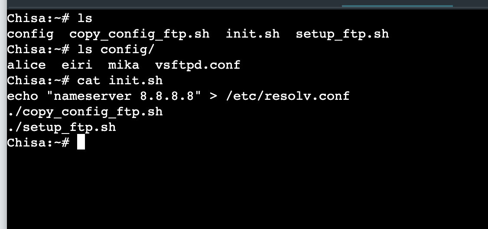

- User alice akan memiliki hak akses **RW (Read Write)**

```bash
write_enable=YES
download_enable=YES
```

- User Mika memiliki hak akses **read only**

```bash
write_enable=NO
download_enable=YES
cmds_allowed=ABOR,CWD,LIST,MDTM,NLST,PASS,PASV,PORT,PWD,QUIT,RETR,SIZE,TYPE,USER
```

- User Eiri tidak memiliki hak akses.

```bash
# Tolak semua izin baca, tulis, maupun unduh
write_enable=NO
download_enable=NO
# Hanya izinkan perintah login dan keluar, sisanya dilarang total
cmds_allowed=USER,PASS,QUIT
```

#### 1. Proof User Alice

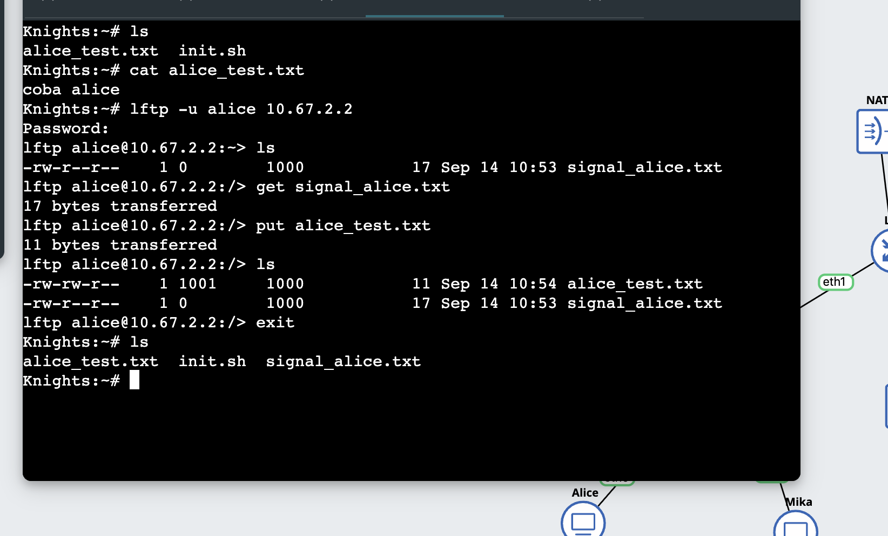

#### 2. Proof User Mika

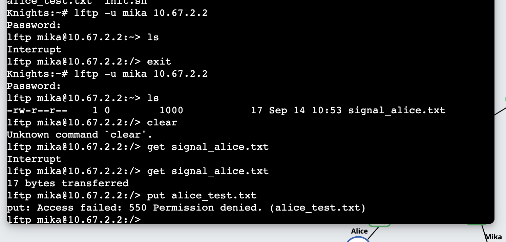

#### 3. Proof User Eiri

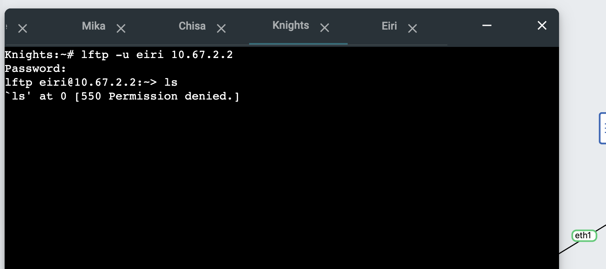

### 8. Analisis Paket FTP

Analisis paket ftp pada file wireshark [report_ftp.pcapng](./config/report_ftp.pcapng) ketika node knights melakukan upload file [knight_reports.txt](./config/knight_reports.txt) ke ftp `Chisa`.

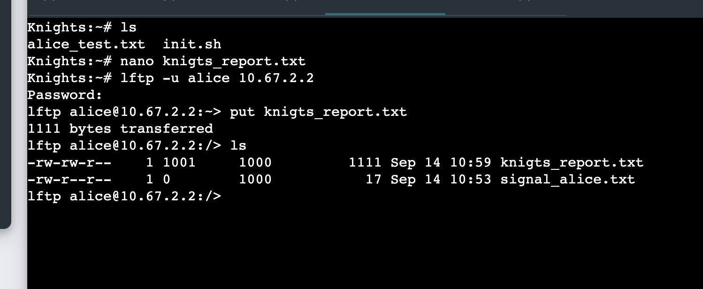

Dengan perintah berikut kami dapat mengetahui paket mana yang sedang melakukan `STOR` di ftp server

```wireshark
ftp.request.command == "STOR"
```

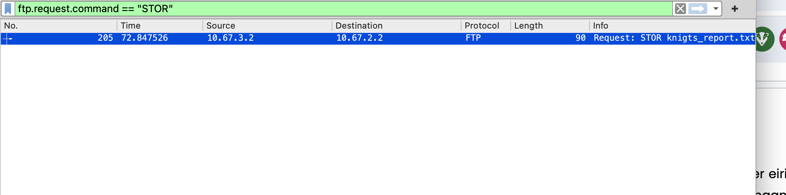

Pada wireshark dapat diliat terdapat 1 traffic yang sedang melakukan `STOR`. Dari `source` dan `destination` dapat diverifikasi jika traffic tersebut merupakan traffic yang benar dari operasi tadi. `10.67.3.2` (Knights) dan `10.67.2.2` (Chisa)

Apabila kita melihat detail traffic terdapat keterangan perintah apa dan file apa yang sedang diupload.

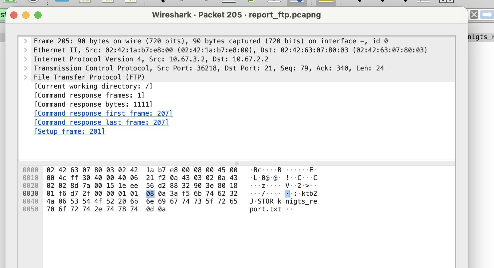

Untuk melihat detail kode status sukses server dapat menggunakan command.

```
ftp.response.code == 226
```

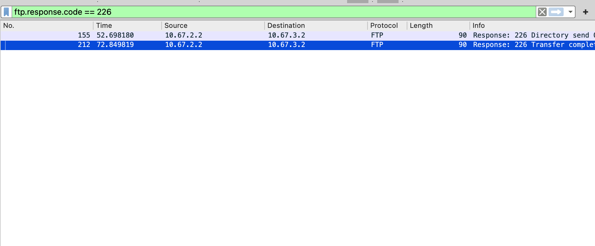

Pada screenshot diatas dapat diliat jika terdapat 2 traffic, yang pertama adalah balasan sukses dari command `ls` atau directory listing dan yang kedua adalah balasan dari file `STOR` sebelumnya.

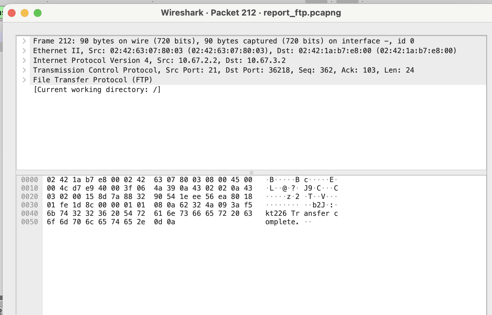

Port Data TCP yang Dinegosiasikan pada Mode PASV

Sesaat sebelum melakukan upload, client meminta untuk masuk ke mode pasif (PASV) agar server yang membuka port untuk transfer data. Pada paket nomor 201, server menyetujuinya dan membalas dengan IP beserta Port yang akan digunakan:

- Respons PASV Server: 227 Entering Passive Mode (10,67,2,2,154,2).
- Kalkulasi Port: Angka 154,2 di akhir representasi IP tersebut digunakan untuk menghitung port TCP yang dibuka. Rumusnya adalah (Angka Pertama × 256) + Angka Kedua. (154 × 256) + 2 = 39424 + 2 = 39426
- Jadi, port data TCP yang dinegosiasikan dan digunakan untuk mentransfer file knigts_report.txt tersebut adalah Port 39426.

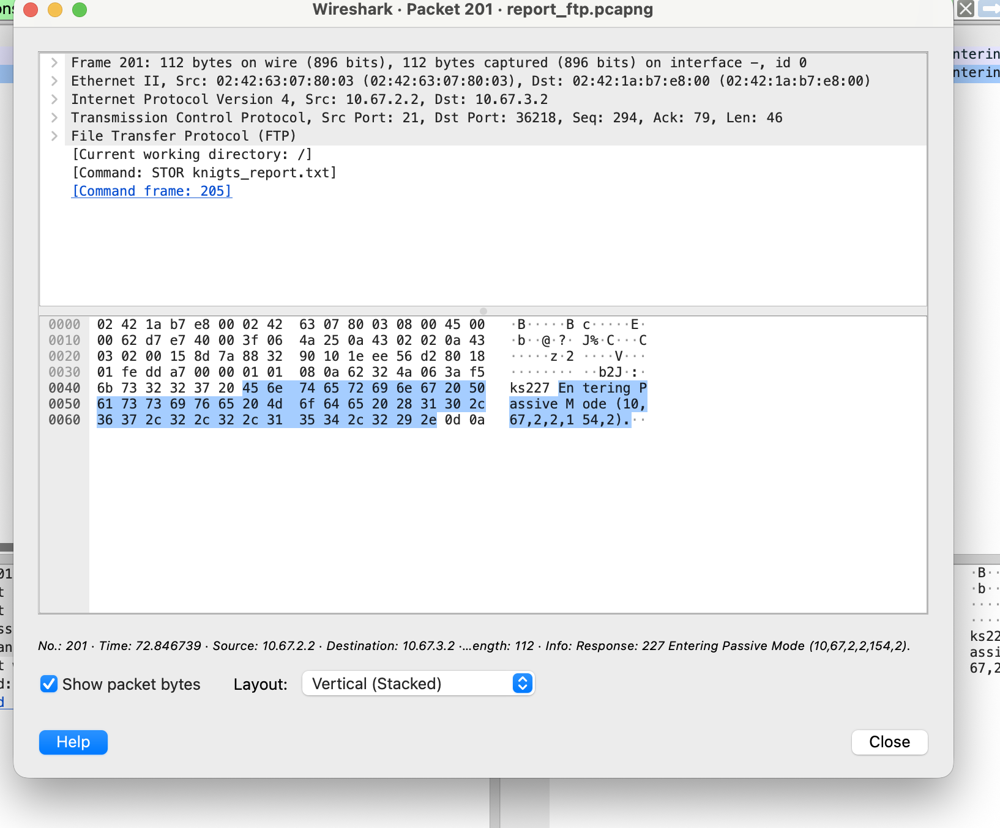

### 9. Permission Denied 550

User Mika berdasarkan konfigurasi hanya memiliki akses terhadap read file (download). Hal ini dapat dibuktikan ketika Node Mika mencoba untuk mengupload file baru dari node Mika.

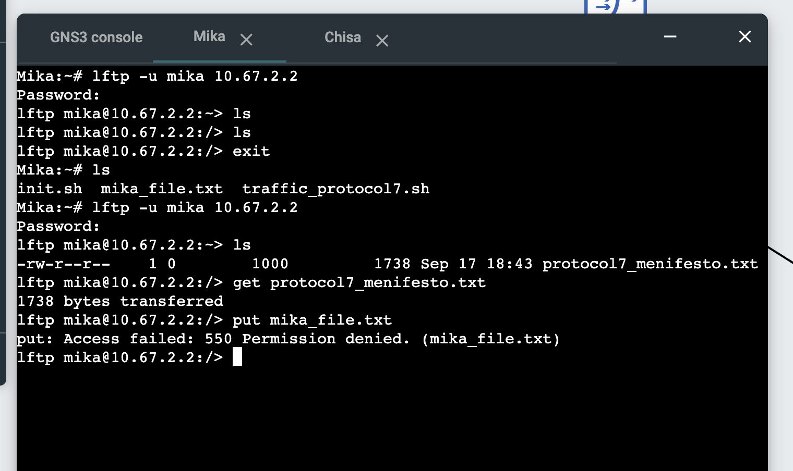

### 10. Analisis Ping Request

Berikut merupakan traffic ICMP (Ping)

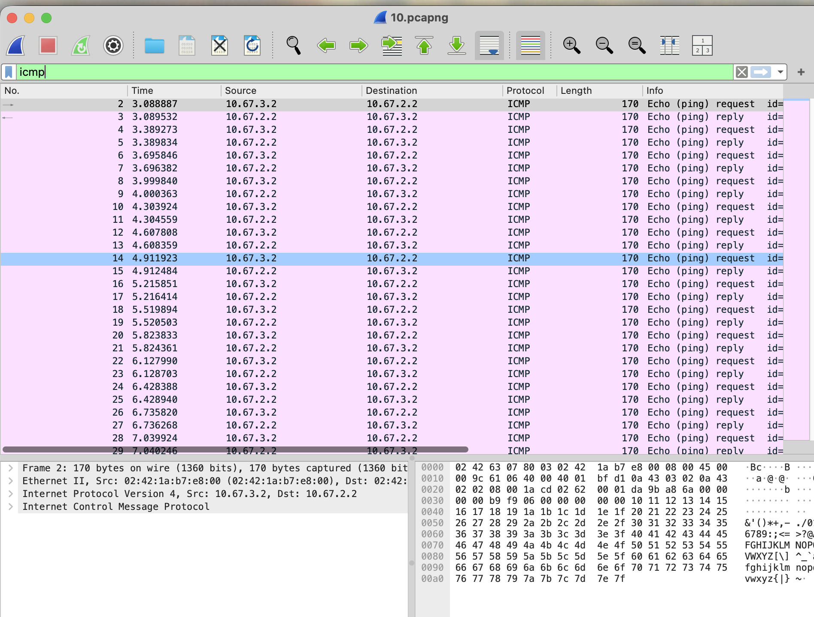

Terlihat ada 154 packet yang mana merupakan 1 icmp req dan 1 icmp response, sehingga total req sesuai yaitu 77 req icmp.

#### 1. Nilai ICMP Type dan Code

Pada pertukaran paket ping (ICMP), terdapat dua jenis pesan yang terlibat:

- Echo Request (Paket dikirim dari Knights ke Chisa): Memiliki nilai Type = 8 dan Code = 0.

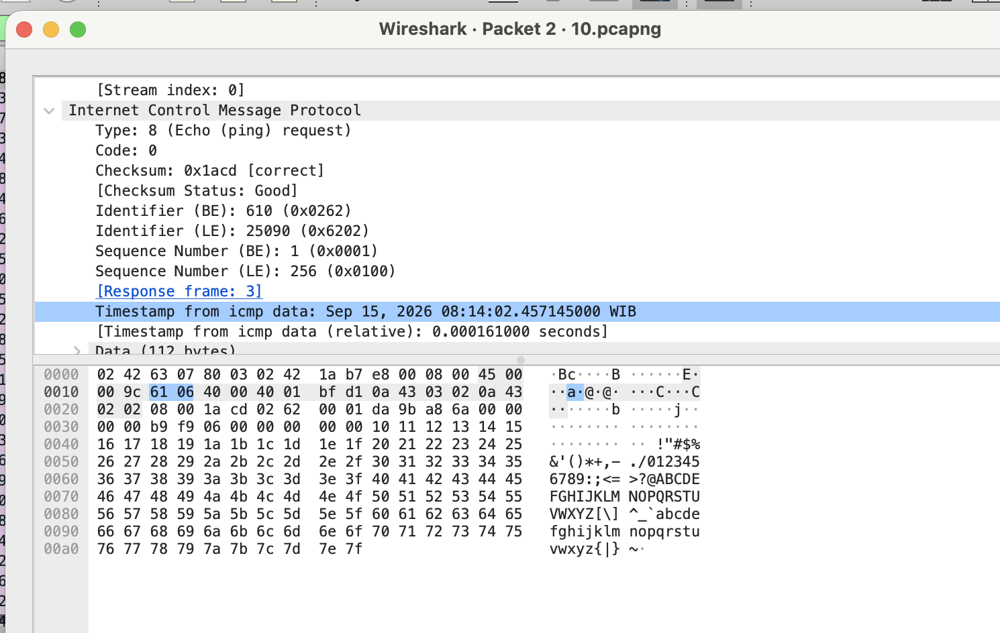

- Echo Reply (Paket balasan dari Chisa ke Knights): Memiliki nilai Type = 0 dan Code = 0.

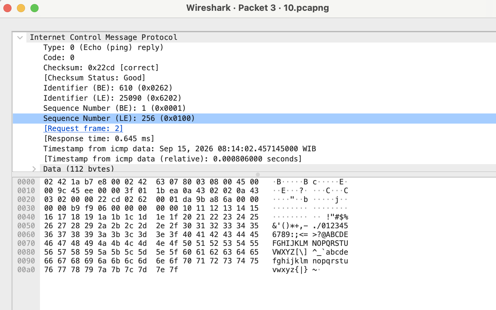

#### 2. Analisis Packet Loss

Dalam pengujian ini, total sebanyak 77 paket (Echo Request) telah dikirimkan.

- Total Request: 77 paket
- Total Reply: 71 paket
- Packet Lost: 6 paket
- Packet Loss Ratio: 7,8%

Terjadi sedikit packet loss (kehilangan paket) sebesar 7,8% di jaringan The Wired yang menandakan adanya sedikit gangguan atau drop di tengah rute pengiriman.

#### 3. Analisis Round Trip Time (RTT / Latensi)

Berdasarkan 71 paket yang berhasil berbalas, perhitungan durasi waktu perjalanan bolak-balik (RTT) antar node tercatat sebagai berikut:

- Minimum RTT (min): 0,199 ms
- Average RTT (avg / mean): 0,368 ms
- Maximum RTT (max): 0,713 ms

Rata-rata latensi tercatat sangat kecil (~0,3 ms) yang menandakan bahwa selain masalah packet loss di atas, kecepatan transfer jaringan secara umum sangat cepat dan stabil.

---

## 11. Analisis Kelemahan Protokol Telnet

Untuk membuktikan kelemahan Telnet, dilakukan koneksi dari node Eiri ke node Chisa menggunakan akun `phantom_user` dengan password `wired_ghost` yang telah dikonfigurasi dulu menggunakan di Node Chisa. Proses ini di-capture menggunakan `tcpdump` untuk dianalisis di Wireshark.

```
tcpdump -i eth0 -w /tmp/telnet_capture.pcap port 23 &
telnet 10.67.2.2
```

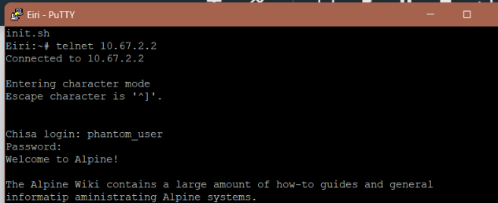

Dari hasil [capture](config/11-chisalogin), terlihat bahwa Telnet tidak mengenkripsi data transmisi apapun. Hal ini terbukti dari hasil Follow TCP Stream pada wireshark, username dan password terbaca sebagai plaintext tanpa enkripsi.

Selain itu, setiap keystroke langsung dikirim ke server tanpa buffering, karena protokol ini dirancang untuk interactive terminal session di mana server perlu merespons setiap karakter secara real-time. Akibatnya, attacker yang melakukan capture dapat merekonstruksi input pengguna secara utuh hanya dari urutan paket.

## 12. Port Scanning dengan Netcat

Untuk mensimulasikan skenario di mana Alice mendeteksi layanan tersembunyi pada node Knights, terlebih dahulu dikonfigurasi dua layanan pada node Knights

```bash
apk add openssh
ssh-keygen -A
/usr/sbin/sshd
apk add nginx
nginx
```

Kemudian dilakukan port scanning dari node Alice menggunakan Netcat ke 3 port berbeda pada node Knights.

```bash
nc -zv 10.67.3.2 22
nc -zv 10.67.3.2 80
nc -zv 10.67.3.2 7777
```

Hasil scan dianalisis di Wireshark untuk membandingkan respons TCP antara port terbuka dan tertutup.

**Port terbuka (22 & 80) - filter `tcp.flags.syn==1 && tcp.flags.ack==1`:**

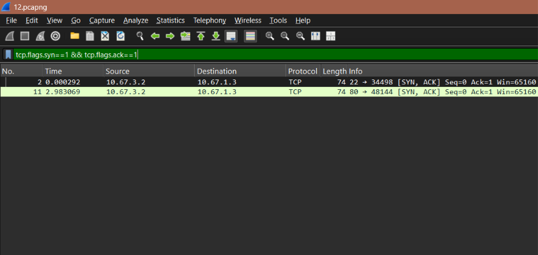

Dua paket SYN-ACK dikembalikan oleh Knights, masing-masing untuk port 22 dan port 80, menandakan ada proses yang aktif listening pada kedua port tersebut.

**Port tertutup (7777) - filter `tcp.flags.rst==1 && tcp.flags.ack==1`:**

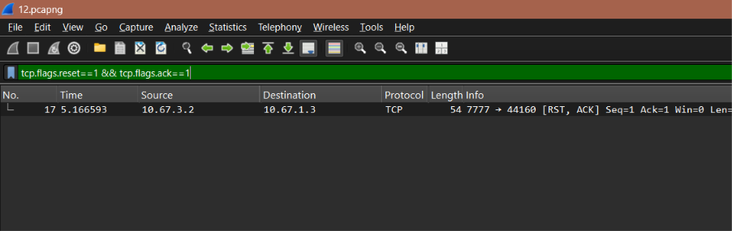

Satu paket RST-ACK dikembalikan untuk port 7777 karena tidak ada proses yang aktif listening pada port tersebut dan tidak ada firewall yang membatasi. Hal ini menandakan bahwa port tertutup dan tidak ada layanan yang berjalan di port tersebut.

## 13. SSH Tanpa Password (Public Key Authentication)

Dikonfigurasi akun `mika_admin` di node Knights yang hanya menerima koneksi SSH berbasis public key dari node Mika.

```bash
adduser mika_admin
mkdir -p /home/mika_admin/.ssh
chmod 700 /home/mika_admin/.ssh
chown -R mika_admin:mika_admin /home/mika_admin/.ssh
```

Public key di-generate di node Mika dan didaftarkan ke `authorized_keys` milik `mika_admin` di Knights. Autentikasi berbasis password kemudian dinonaktifkan, memaksa Knights hanya menerima koneksi yang dapat membuktikan kepemilikan private key.

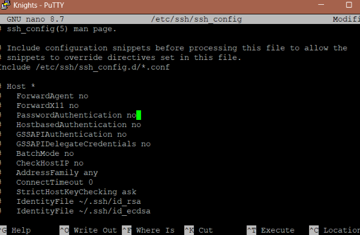

Mika berhasil login ke Knights tanpa memasukkan password.

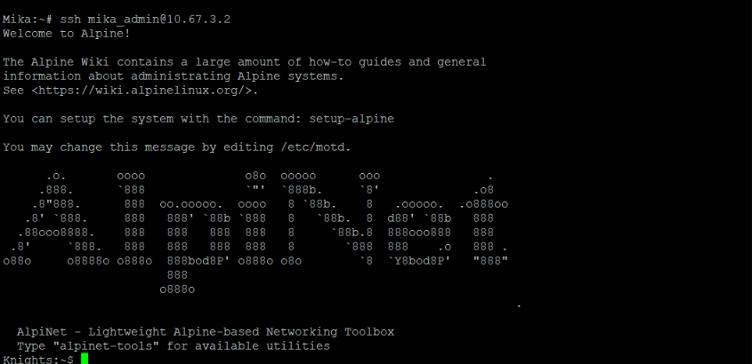

Dari hasil capture, tidak ada kredensial yang terkirim melalui jaringan. Yang terlihat hanya Protocol Version Exchange dan Key Exchange, sisanya terenkripsi dan tidak dapat dibaca atau decode.

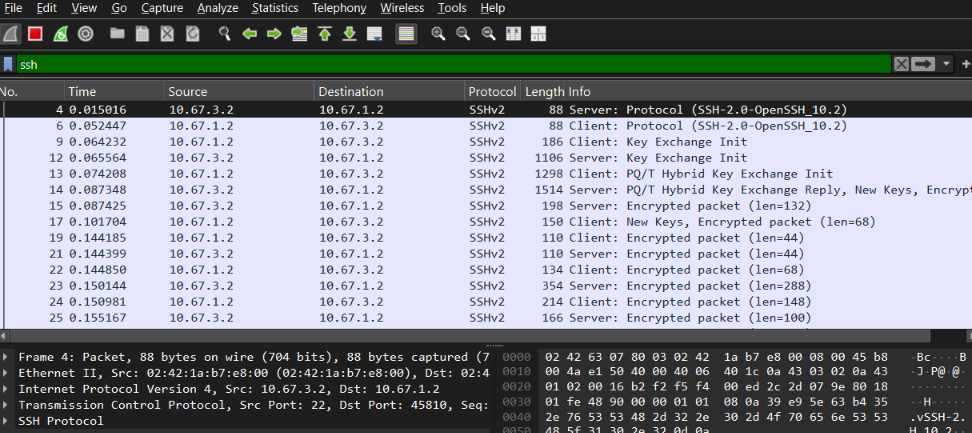

## 14. Analisis Serangan Brute-Force pada Web Alice

Dari file capture `wired_bruteforce.pcapng`, diidentifikasi serangan brute-force terhadap form login pada web Alice.

Dengan filter `http.response`, ditemukan 52 percobaan POST dari attacker ke target dari 52 percobaan, sebagian besar mengembalikan response 401 (gagal), satu 404 (tidak ditemukan), dan dua percobaan berhasil mengembalikan 200 OK, ditemukan kredensial diantaranya:

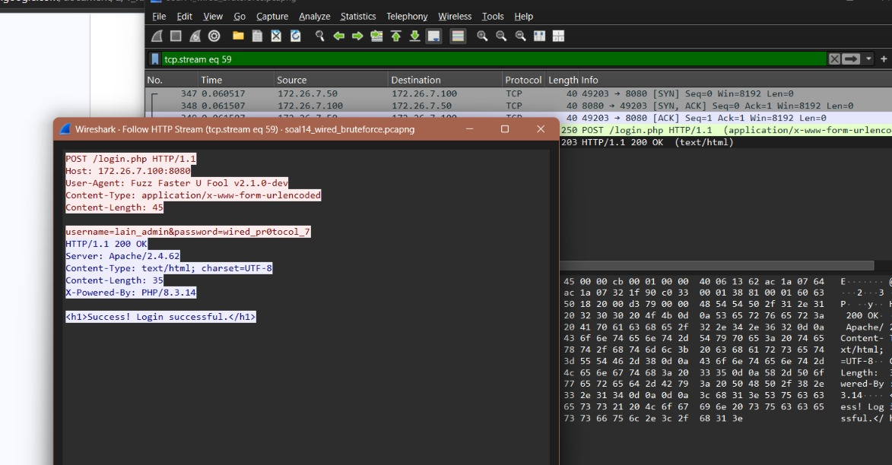

Sehingga hasil temuan dapat disimpulkan melalui tabel berikut:

| Keterangan    | Detail                      |
| ------------- | --------------------------- |
| IP Penyerang  | 172.26.7.50                 |
| IP Target     | 172.26.7.100 port 8080      |
| Web Server    | Apache/2.4.62               |
| user:password | lain_admin:wired_pr0tocol_7 |

Validasi temuan pada socket server menghasilkan flag: `KOMJAR26{W1r3d_Brut3_H0yZsExJta1BCs3ArnWVuPx21}`

## 15. Analisis Serangan USB HID (Keystroke Injection)

Terdapat perangkat keyboard berbahaya pada node Alice yang dapat dianalisis melalui file `wired_usb_hid.pcap` dilakukan filtering umum terlebih dahulu seperti `usb` dan cari detail dari `DEVICE DESCRIPTOR response`

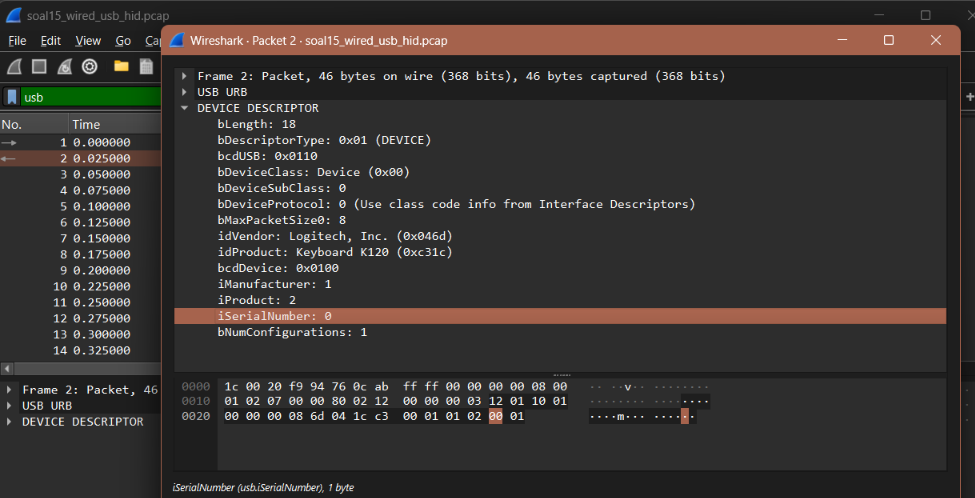

Setelah mendapatkan `Vendor ID`, `Product ID`, dan `Device Adress` dilanjutkan dengan filtering paket-paket keystroke melalui filter `usb.capdata`. Terdapat 26 paket format HID Keyboard yang di-decode melalui referensi git [ini.](https://github.com/tmk/tmk_keyboard/wiki/USB%3A-HID-Usage-Table?utm_source=chatgpt.com)

```
02001a00
Left Shift + w = W
.. dst.
```

Keystroke yang berhasil direkonstruksi dari data HID mengungkap pesan rahasia:
`Wired_Protocol_7_is_alive_2026`

| Keterangan     | Detail                         |
| -------------- | ------------------------------ |
| Vendor ID      | 046d                           |
| Product ID     | c31c                           |
| Device Address | 7                              |
| Secret Message | Wired_Protocol_7_is_alive_2026 |


Validasi temuan pada socket server menghasilkan flag: `KOMJAR26{USB_K3ystr0k3_dL44AUoovdlk9KE91tzbyjzO3}`

## 16. Analisis Pencurian File Malware melalui FTP

Diberikan file capture `wired_ftp_theft.pcap` untuk identifikasi aktivitas pengunduhan file mencurigakan menggunakan FTP.

Dengan filter `ftp.request.command == "RETR"`, ditemukan pengunduhan file `knights*payload.exe* oleh attacker yang memiliki detail kredensial seperti [ini.](config/16-ftp-thief)

| Keterangan  | Detail              |
| ----------- | ------------------- |
| IP Attacker | 198.51.100.7        |
| Username    | knights_agent       |
| Password    | N4v1_s3cure_2026    |
| FTP Server  | vsftpd 3.0.5        |
| File        | knights_payload.exe |
| Ukuran      | 524288 bytes        |

Validasi temuan pada socket server menghasilkan flag: `KOMJAR26{FTP_Th3ft_dD5Dtocvo91O5гGC3Gip2kohC}`

## 17. Analisis Pengunduhan Malware melalui HTTP

Terdapat payload berbahaya yang diinstall Eiri pada halaman web Alice di node-nya melalui HTTP dan dapat dianalisis dalam file capture `wired_http_c2.pcap`.

Setelah melakukan filtering `http.request` dan melakukan http stream, ditemukan detail-detail yang bisa ditemukan [disini](config/17-payloadstream) dan alamat IP attacker dari source address

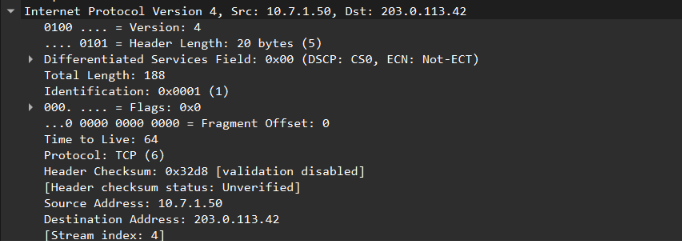

Sehingga ringkasan temuan dari file capture ini yaitu:

| Keterangan       | Detail             |
| ---------------- | ------------------ |
| Domain (Host)    | `wired-update.net` |
| File Executable  | navi_agent.exe     |
| Kode status HTTP | 200                |
| IP Attacker      | 203.0.113.42       |

Validasi temuan pada socket server menghasilkan flag: `KOMJAR26{Navi_C2_D0wnl04d_3YIA2bqDaR53O6grIoj3DgFEH}`

## 18. Analisis Penyebaran Malware melalui SMB

Terdapat file capture `wired_smb_transfer.pcapng`, untuk menganalisis penyebaran malware menggunakan protokol file sharing SMB.

Karena filtering `smb` kosong, filtering `smb2` khususnya `CREATE request [System32/wired_trojan_payload.exe]` memberikan hasil stream seperti [ini](config/18-smbprotocol) dan detail IP

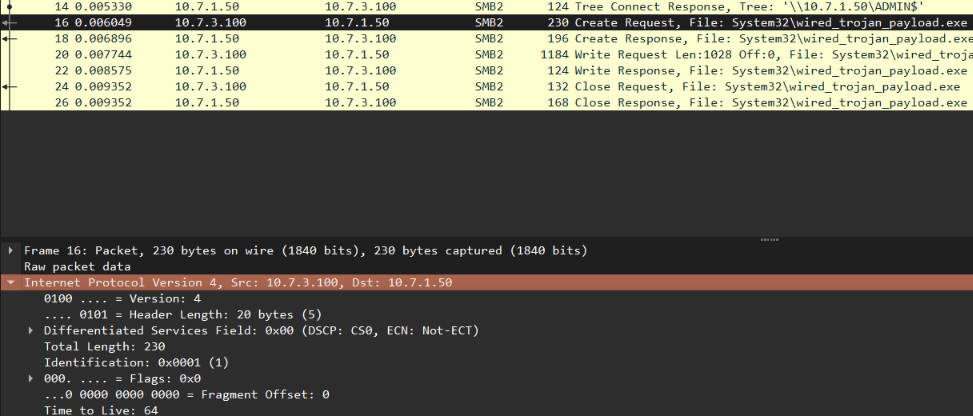

Ringkasan temuan dalam tabel berikut
| Keterangan| Detail |
|-|-|
| IP Attacker |10.7.3.100|
| IP Victim| 10.7.1.50 |
| Jarringan yang dieksploitasi | ADMIN$|
| File Executable |wired_trojan_payload.exe|


Validasi temuan pada socket server menghasilkan flag: `KOMJAR26 {SMB_Tr4nsf3r_zli0KTe8ewjVOf9eM5RnIsD3V)`

---

## 19. Analisis Email Pemerasan melalui SMTP

Terdapat pesan ancaman pemerasan melalui protokol SMTP tanpa enkripsi, file `wired_smtp_threat.pcap` dapat dianalisis untuk menggali informasi dari pesan tersebut.

Setelah menggunakan filter `smtp`, terdapat 16 paket yang diantaranya berisikan threat mail tanpa enkripsi yang dapat dilihat [disini.](config/19-letsAllLoveLain)

Dari pesan itu terdapat temuan yang diringkas menjadi:

| Keterangan     | Detail                   |
| -------------- | ------------------------ |
| Email Korban   | `victim@protocol7.co.jp` |
| Password Bocor | pr0tocol_7_user          |
| Jenis Malware  | Ransomware               |
| Batas Waktu    | 3 hari/72h               |
| MailClientID   | 7719980706               |


Validasi temuan pada socket server menghasilkan flag: `KOMJAR26 {SMTP_Ext0rt10n_G0xwXQXWvq85OawCDLeku99j7}`

---

## 20. Analisis Komunikasi Malware Terenkripsi TLS

Di soal ini, komunikasi malware disembunyikan di balik traffic HTTPS terenkripsi sehingga sebelum kita analisis file capture `wired_tls_decrypt.pcapng` perlu Session Key dari `keyslogfile.txt` untuk dipasangkan di field Wireshark bagian `(Pre)-Master-Secret log file`

Setelah file berhasil di-decrypt, menggunakan fitur detail pada kolom di bagian bawah untuk menemukan versi TLS yang dinegoisasikan beserta IP server attacker.

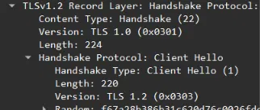
dan

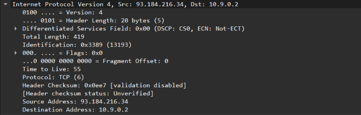

Lalu dengan filtering `http` ditemukan stream seperti pada [link ini.](config/20-decrypted)

Sehingga tabel temuan dari soal ini adalah seperti berikut:

| Keterangan   | Detail        |
| ------------ | ------------- |
| Versi TLS    | TLSv1.2       |
| Domain (SNI) | example.com   |
| IP Server    | 93.184.216.34 |
| User-Agent   | curl/7.62.0   |
| HTTP Method  | HEAD          |
| Path         | / HTTP/1.1    |


Validasi temuan pada socket server menghasilkan flag: `KOMJAR26(TLS_D3crypt_UASAuE8QELYaS5EaiZctN2si1}`
