# Kelompok K-07 Laporan Resmi Jarkom Modul 1

## Anggota Kelompok

| Nama                   | NRP        |
| :--------------------- | :--------- |
| Evandra Raditya Fauzan | 5027251001 |
| Keisya Dira Anugerah   | 5027251055 |

## Daftar Isi

1. [Topologi Jaringan](#1-topologi-jaringan)
2. [Network Address Translation](#2-network-address-translation)
3. [Static Routing](#3-static-routing)
4. [Firewall dan iptables](#4-firewall-dan-iptables)
5. [Initial Script](#5-initial-script)
6. [Identifikasi Paket ICMP dan DNS](#6-identifikasi-paket-icmp-dan-dns)

## Laporan Resmi

### 1. Topologi Jaringan

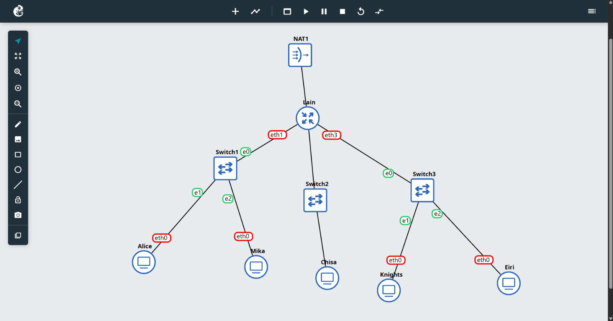

Topologi Jaringan dibuat menjadi seperti gambar di atas. Sebuah router dengan nama `Lain` terhubung ke sebuah adapter NAT untuk terkoneksi dengan internet. Router tersebut menjadi gateway utama dari beberapa jaringan yang ada di bawahnya. Pada layer dibawah router terdapat 3 buah switch yang masing masing terhubung dengan 1 hingga 2 client.

#### Switch 1

- Network: 10.67.1.0/24
- Netmask: 255.255.255.0
- Gateway: 10.67.1.1/24

##### Alice

- IP: 10.67.1.2/24
- Netmask: 255.255.255.0
- Default Gateway: 10.67.1.1/24

##### Mika

- IP: 10.67.1.3/24
- Netmask: 255.255.255.0
- Default Gateway: 10.67.1.1/24

#### Switch 2

- Network: 10.67.2.0/24
- Netmask: 255.255.255.0
- Gateway: 10.67.2.1/24

##### Chisa

- IP: 10.67.2.2/24
- Netmask: 255.255.255.0
- Default Gateway: 10.67.2.1/24

#### Switch 3

- Network: 10.67.3.0/24
- Netmask: 255.255.255.0
- Gateway: 10.67.3.1/24

##### Knights

- IP: 10.67.3.2/24
- Netmask: 255.255.255.0
- Default Gateway: 10.67.3.1/24

##### Eiri

- IP: 10.67.3.3/24
- Netmask: 255.255.255.0
- Default Gateway: 10.67.3.1/24

Semua konfigurasi interface terdapat pada folder [config](./config)

### 2. Network Address Translation

Pada router Lain, interface `eth0` dapat dikoneksikan ke sebuah adapter NAT untuk mendapatkan akses internet.

### 3. Static Routing

Semua device yang terhubung ke router lain berada pada subnet/jaringan yang berbeda. Agar mereka bisa saling berkomunikasi maka router `Lain` harus dikonfigurasi dengan static routing.

Jaringan akan dipetakan ke interface tujuan dari jaringan tersebut. Harapannya client yang ada pada jaringan yang berbeda dapat mengetahui ke mana mereka harus berkomunikasi.

```
# /etc/network/interfaces
10.67.1.0/24 dev eth1 proto kernel scope link src 10.67.1.1
10.67.2.0/24 dev eth2 proto kernel scope link src 10.67.2.1
10.67.3.0/24 dev eth3 proto kernel scope link src 10.67.3.1
```

#### Bukti jaringan sudah terhubung

1. Knights ke network 10.67.1.0/24
   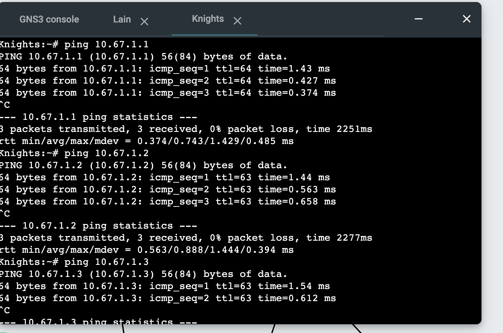

2. Knights ke network 10.67.2.0/24
   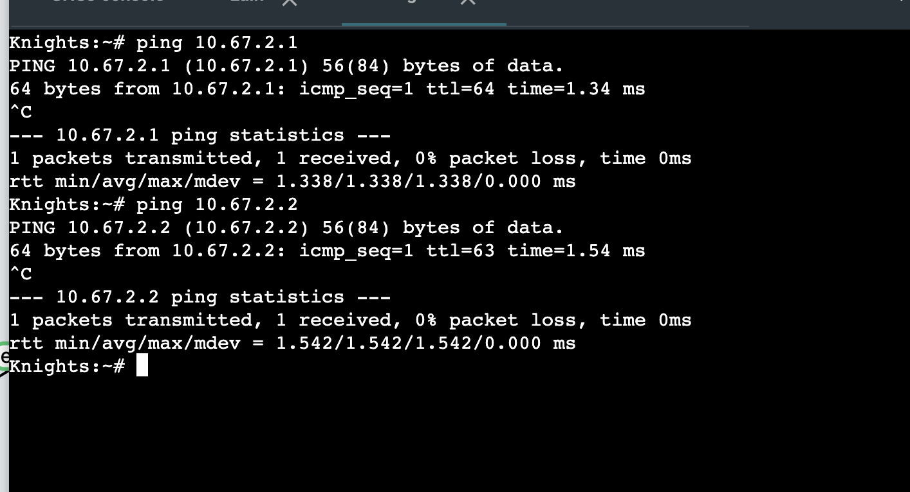

3. Knights ke network 10.67.3.0/24
   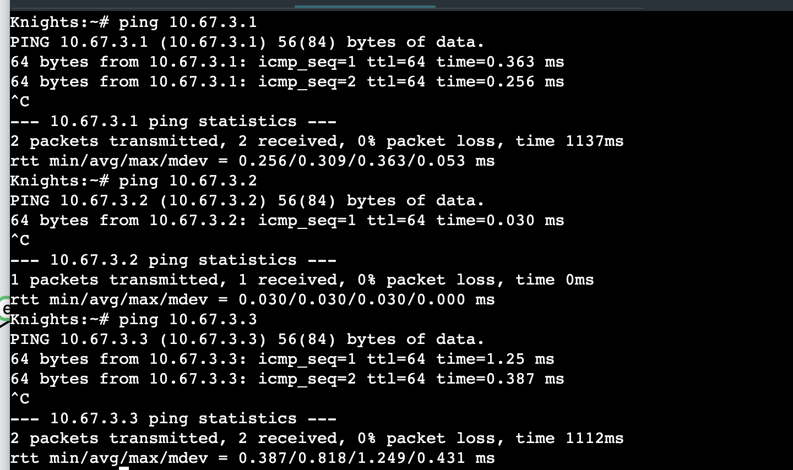

4. Alice ke network 10.67.1.0/24
   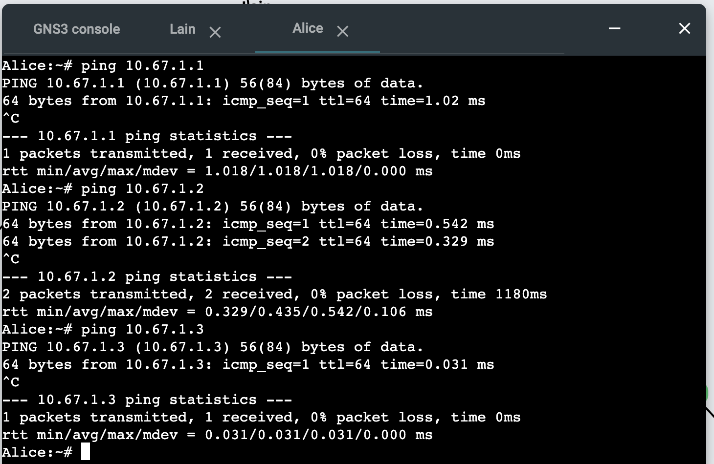

5. Alice ke network 10.67.2.0/24
   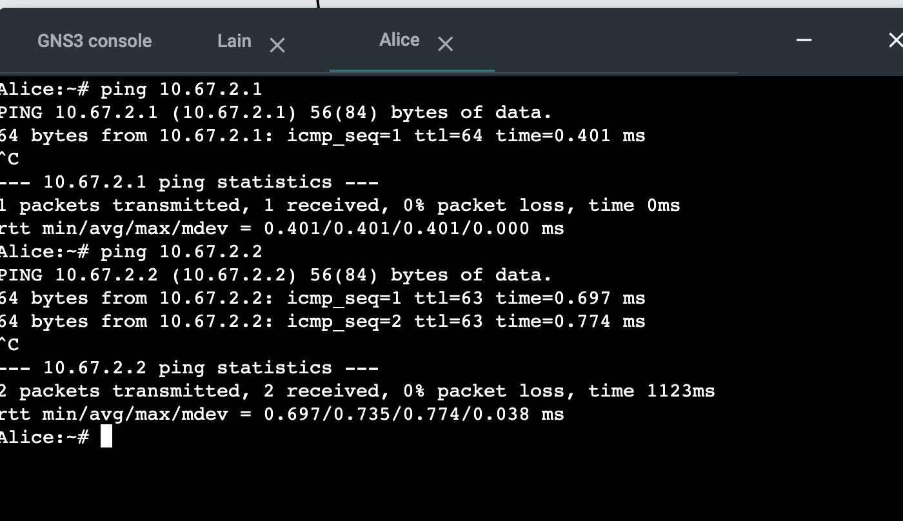

6. Alice ke network 10.67.3.0/24
   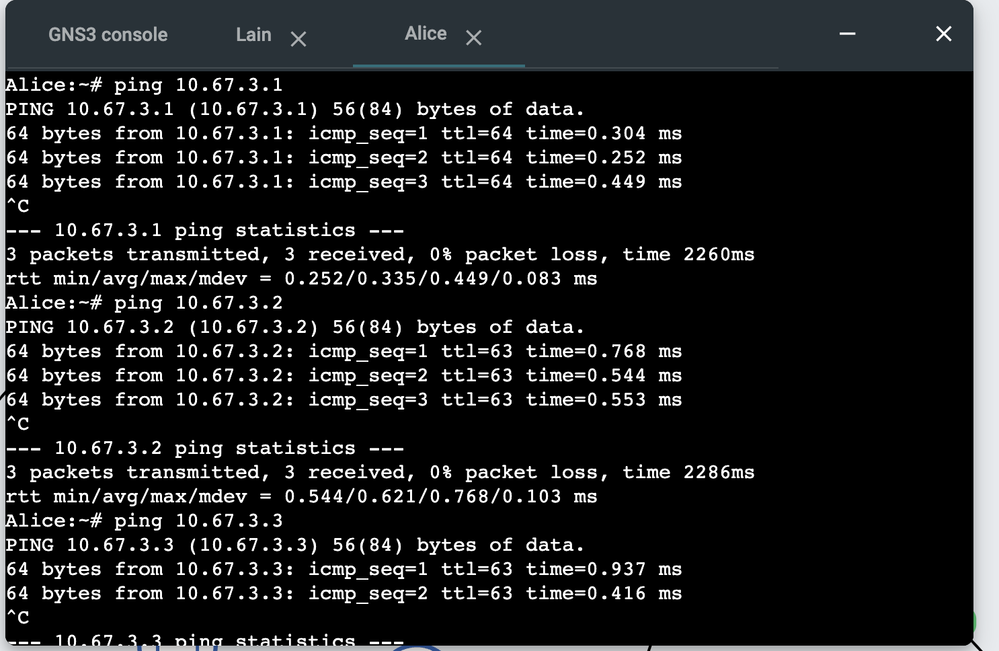

7. Mika ke network 10.67.1.0/24
   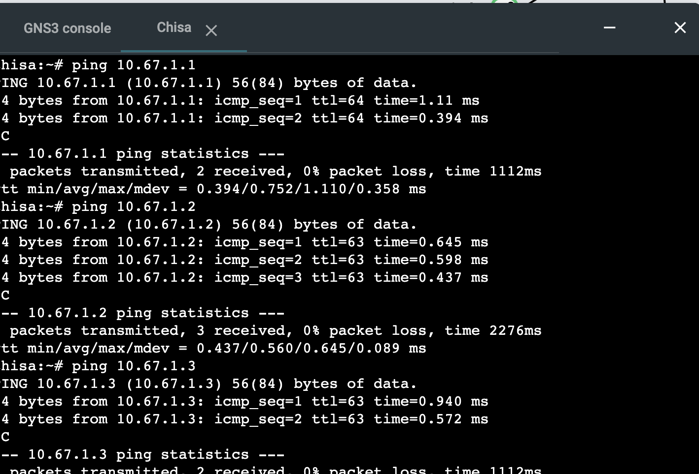

8. Alice ke network 10.67.2.0/24
   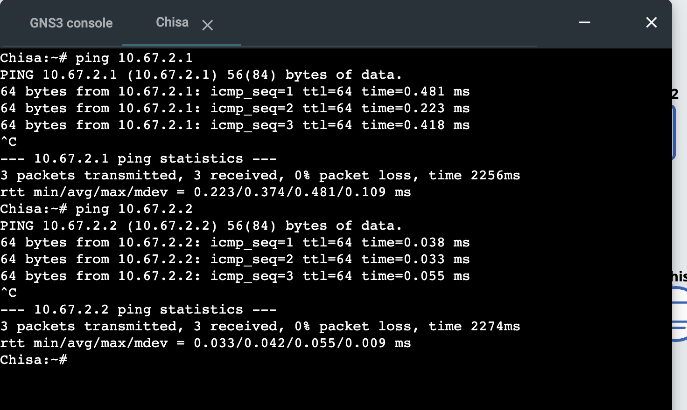

9. Alice ke network 10.67.3.0/24
   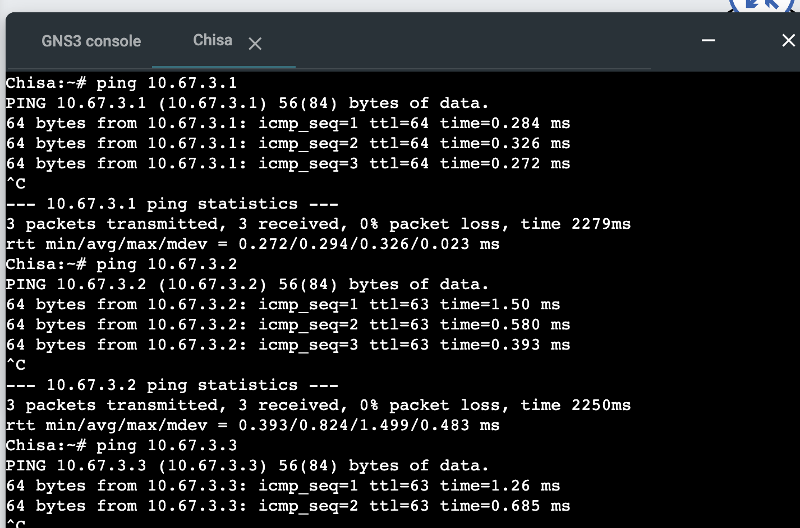

\*untuk client di network yang sama tidak kami cantumkan pada lapres

### 4. Firewall dan iptables

Meskipun router sudah terhubung dengan sebuah adapter NAT. Client yang terhubung tidak bisa langsung terkoneksi ke internet. Router perlu dikonfigurasi dengan sebuah firewall untuk meneruskan akses internet yang dimiliki router ke client yang terhubung.

```bash
iptables -t nat -A POSTROUTING -o eth0 -j MASQUERADE
sysctl -w net.ipv4.ip_forward=1
```

Command di atas akan menambahkan ke chain POSTROUTING dari interface eth0, masquarade akan menggantikan ip lokal ke ip public milik interface eth0 dari router `Lain`.

Agar tiap client bisa menerjemahkan domain ke alamat ip, maka tiap client wajib menambahkan `nameserver` yang digunakan, dalam hal ini dapat menggunakan `8.8.8.8` sebagai default dns/nameserver.

```bash
echo "nameserver 8.8.8.8" > /etc/resolv.conf
```

Berikut bukti client dapat terhubung ke internet dan melakukan ping ke google.com

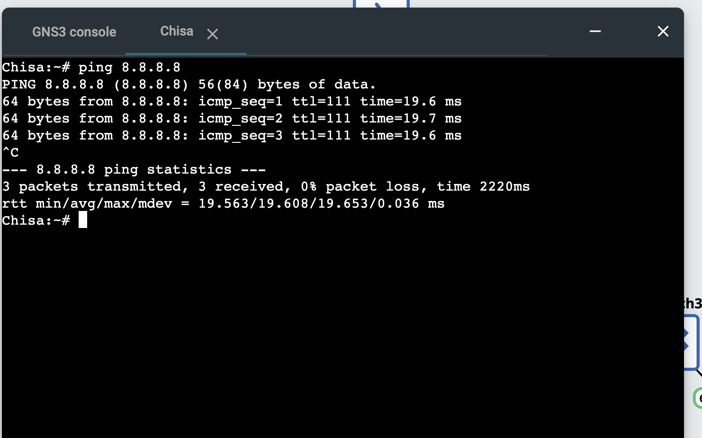

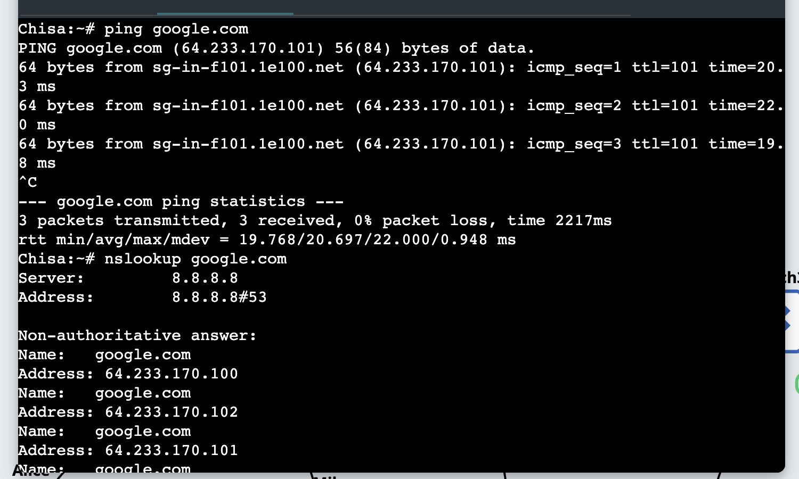

### 5. Initial Script

Untuk memastikan keseluruhan konfigurasi jaringan tidak menghilang ketika terjadinya restart maka kami membuat beberapa initial script untuk melakukan setup jaringan.

Initial script pertama adalah terkait iptables/firewall dan juga dns.

Kami menambahkan script berikut ke dalam file /root/init.sh

```bash
iptables -t nat -A POSTROUTING -o eth0 -j MASQUERADE
sysctl -w net.ipv4.ip_forward=1
```

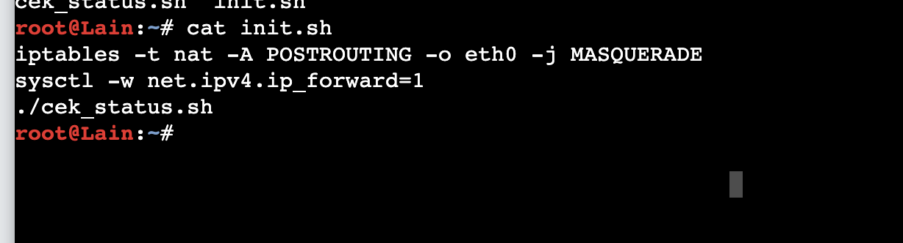

Untuk kebutuhan pengecekan/verifikasi interface dan table NAT, kami membuat file baru yaitu `cek_status.sh`

```bash
#!/bin/bash
echo "=== RINGKASAN INTERFACE ==="
ip -br a
echo ""
echo "=== TABEL NAT POSTROUTING ==="
iptables -t nat -L POSTROUTING -v -n
```

Tak lupa kami memasukkan script running file `/root/cek_status.sh` ke dalam `/root/init.sh`

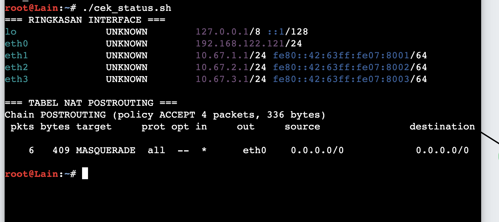

### 6. Identifikasi Paket ICMP dan DNS

Berdasarkan file traffic.pcapng yang digenerate oleh script traffic_protocol7.sh, terdapat 48 paket yang tertangkap oleh filter dns or  
 icmp. Berikut adalah rincian aktivitasnya:

#### 1. Traffic DNS (Domain Name System)

Terlihat adanya aktivitas resolving domain (pencarian alamat IP) ke dua server DNS berbeda (Google 8.8.8.8 dan Cloudflare 1.1.1.1):

- Ke 8.8.8.8:
  - Query A (IPv4) dan AAAA (IPv6) untuk its.ac.id, google.com, dan example.com.
  - Query PTR (Reverse DNS) untuk IP 103.94.189.5 (milik its.ac.id).

    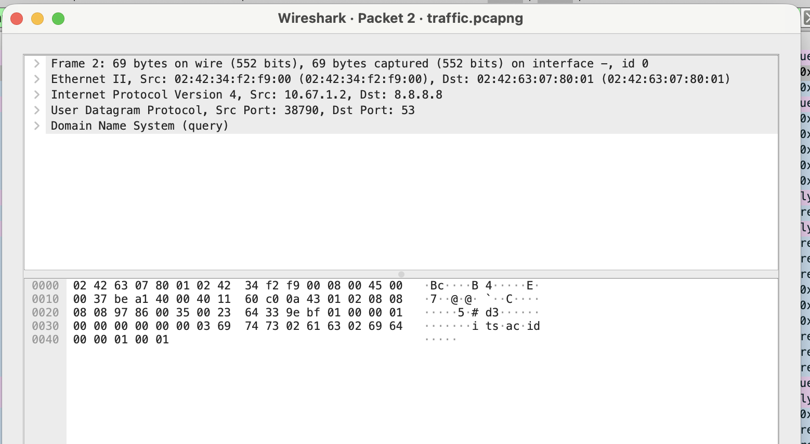
    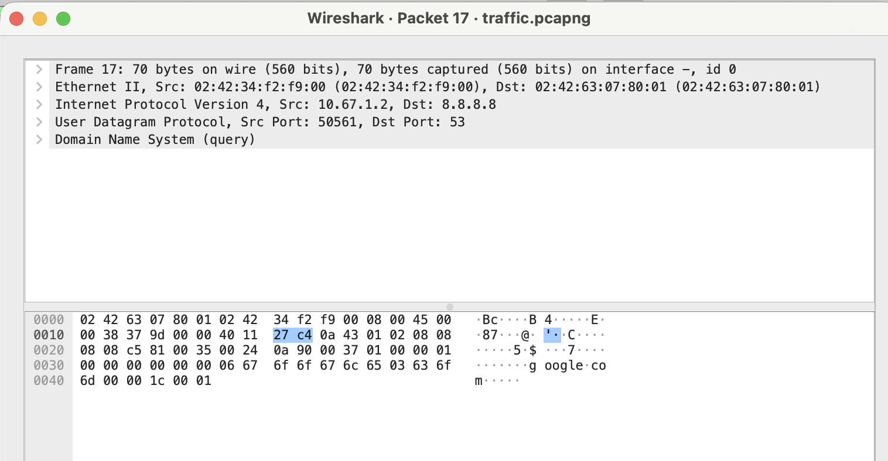

- Ke 1.1.1.1:
- - Query A (IPv4) dan AAAA (IPv6) untuk github.com dan cloudflare.com.
  - Terdapat balasan (response) dari masing-masing server DNS yang memberikan IP Address untuk domain-domain tersebut, baik berupa record
    A maupun SOA (Start of Authority) ketika record yang dicari tidak tersedia/membutuhkan otoritas lebih lanjut.

#### 2. Traffic ICMP (Internet Control Message Protocol)

Setelah beberapa alamat IP berhasil didapatkan via DNS, terjadi pengiriman ping (Echo Request & Reply) dari IP sumber 10.67.1.2 (Mika) ke tiga
tujuan yang berbeda:

- Ping ke IP 1.1.1.1: Terjadi 5 kali pertukaran (Request & Reply).
- Ping ke IP 8.8.8.8: Terjadi 5 kali pertukaran (Request & Reply).
- Ping ke IP 103.94.189.5 (IP dari its.ac.id yang didapat melalui DNS sebelumnya):

Terjadi 3 kali pertukaran (Request & Reply).

(Seluruh ping berhasil dibalas (Reply) oleh server tujuan).

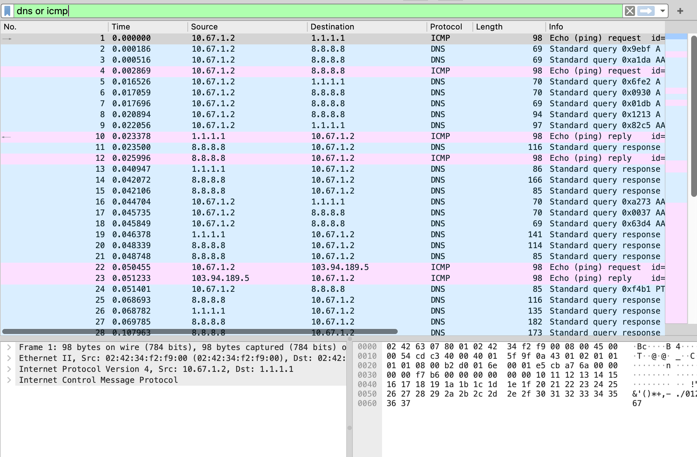
